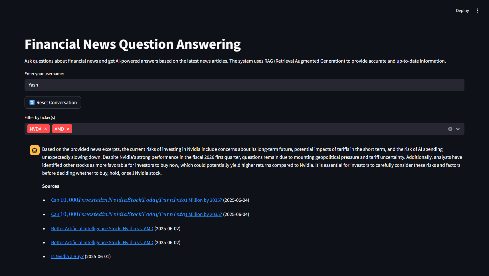
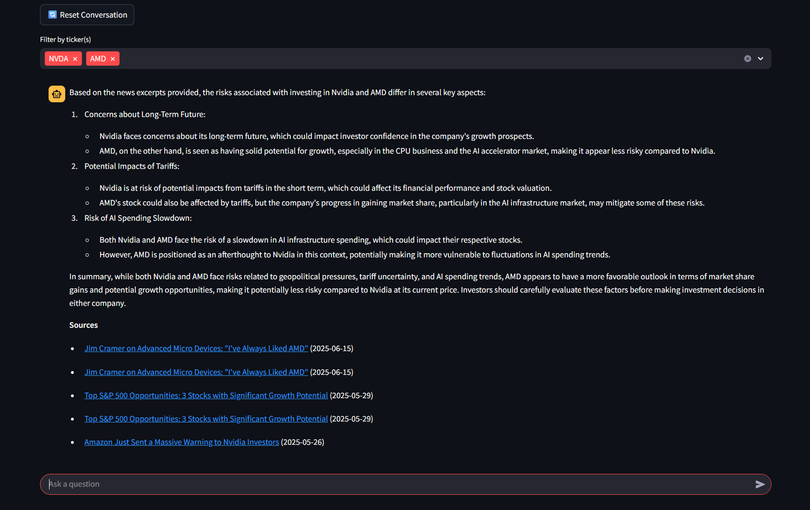

# RAG - Financial News Q&A Agent

A production-ready Python-based Retrieval-Augmented Generation (RAG) system designed to answer stock-related questions by scraping, processing, and embedding financial news articles. The system combines web scraping (Scrapy), semantic search (ChromaDB), embeddings (HuggingFace), and LLM-powered responses (OpenAI ChatGPT) to provide contextual, up-to-date financial insights.


## Features

- **Intelligent Web Scraping**: Automated financial news collection from FinViz with 40,000+ articles stored
- **Advanced Text Processing**: Smart chunking and cleaning of articles for optimal embeddings
- **Semantic Search**: Fast, relevant document retrieval using ChromaDB vector database
- **Context-Aware Responses**: RAG-powered Q&A with conversation memory and ticker filtering
- **Webapp Interface**: Streamlit web app, and FastAPI REST endpoints
- **Session Management**: Persistent conversation history across sessions
- **Modular Architecture**: Clean separation of concerns with configurable components
- **Easy Installation**: Simple pip install with optional dependency groups

## Sample Conversation

Below is an example conversation demonstrating the system's capabilities:




## Quick Start

### 1. Installation

```bash
# Clone the repository
git clone https://github.com/Yahlawat/Financial-News-Agent.git
cd Financial-News-Agent

# Install the package in editable mode with all dependencies
pip install -e .[scraper,api,ui,rag]

# Or install specific components only
pip install -e .[rag]  # Just RAG components
pip install -e .[api,ui]  # Just the interfaces
```

### 2. Environment Setup

```bash
# Copy environment template
cp env.example .env

# Edit .env and add your OpenAI API key
OPENAI_API_KEY=your_openai_api_key_here
```

### 3. Data Collection & Processing

```bash
# Scrape financial news (this may take several hours for full S&P500, reduce number of tickers for faster scraping)
finnews-scrape

# Process and chunk articles
finnews-chunk

# Generate embeddings and build vector database
finnews-embed
```

### 4. Run the Application

#### API Server (FastAPI)
```bash
finnews-api
```

#### Web Interface (Streamlit)
```bash
finnews-ui
```

### Console Scripts
After installing in editable mode, you can use these convenient commands:

```bash
finnews-scrape      # Run Scrapy spider
finnews-chunk       # Build chunks from raw articles
finnews-embed       # Build/update Chroma index
finnews-cleanup     # Clean up old articles (selective deletion)
finnews-api         # Start FastAPI server
finnews-ui          # Start Streamlit web interface
```

### Scrapy config location change
- The former `config/` directory has been removed.
- `scrapy.cfg` now resides at the repository root. Run Scrapy commands from the repo root (e.g., `scrapy crawl finviz_news`) or set `SCRAPY_SETTINGS_MODULE=finnews.scraper.settings` if running elsewhere.

## Project Architecture

```
Financial-News-Agent/
├── src/finnews/           # Main package
│   ├── api/               # FastAPI REST endpoints
│   ├── ui/                # Streamlit web interface  
│   ├── rag/               # RAG pipeline components
│   ├── scraper/           # Scrapy news scraper
│   ├── scripts/           # CLI utilities
│   └── common/            # Shared configuration
├── data/                  # Data storage
│   ├── raw_news/          # Scraped articles
│   ├── processed_chunks/  # Text chunks
│   ├── chroma_store/      # Vector database
│   ├── chat_memory/       # Conversation history
│   └── tickers/           # S&P 500 tickers
├── tests/                 # Test suite
└── docs/                  # Documentation
```

📋 **Detailed structure**: See [docs/STRUCTURE.md](docs/STRUCTURE.md)

## Key Components

### Data Pipeline
- **Scraper**: Automated collection of financial news from FinViz with duplicate detection
- **Chunker**: Intelligent text segmentation optimized for semantic search
- **Embedder**: HuggingFace-based vector embeddings using BAAI/bge-base-en-v1.5

### RAG System
- **Retriever**: Multi-stage document retrieval with ticker filtering and recency scoring
- **Memory**: Persistent conversation context using ChromaDB
- **Generator**: OpenAI GPT-4o-mini for structured, context-aware responses

### Interface
- **Streamlit**: User-friendly web interface with session management
- **FastAPI**: RESTful API for integration with external applications

### Ticker Management
The system uses S&P 500 companies by default. Update `data/tickers/tickers.csv` to modify the scope:

```bash
python data/tickers/get_sp500_tickers.py  # Refresh S&P 500 list
```

## Configuration

All settings are centralized in `src/finnews/common/config.py`:

| Setting | Default | Environment Variable |
|---------|---------|---------------------|
| **API Key** | None | `OPENAI_API_KEY` |
| **LLM Model** | `gpt-4o-mini` | `LLM_MODEL` |
| **Embedding Model** | `BAAI/bge-base-en-v1.5` | `EMBEDDING_MODEL` |
| **API Port** | 8000 | `API_PORT` |
| **UI Port** | 8501 | `STREAMLIT_PORT` |

📋 **Full configuration guide**: See [docs/RUNBOOK.md](docs/RUNBOOK.md)

## Advanced Features

### Session Persistence
- Conversations automatically resume across sessions
- User-specific chat history with ChromaDB storage
- Session reset functionality for fresh conversations

### Smart Retrieval
- Document reranking based on publication date recency
- Ticker-specific filtering for focused results
- Conversation context integration for follow-up questions

### Scalable Architecture
- Batch processing for large-scale embedding generation
- Duplicate detection and incremental updates
- Production-ready FastAPI deployment

## License

MIT License - see LICENSE file for details.

---

**Built by Yash Ahlawat** | *Showcasing expertise in RAG systems*
